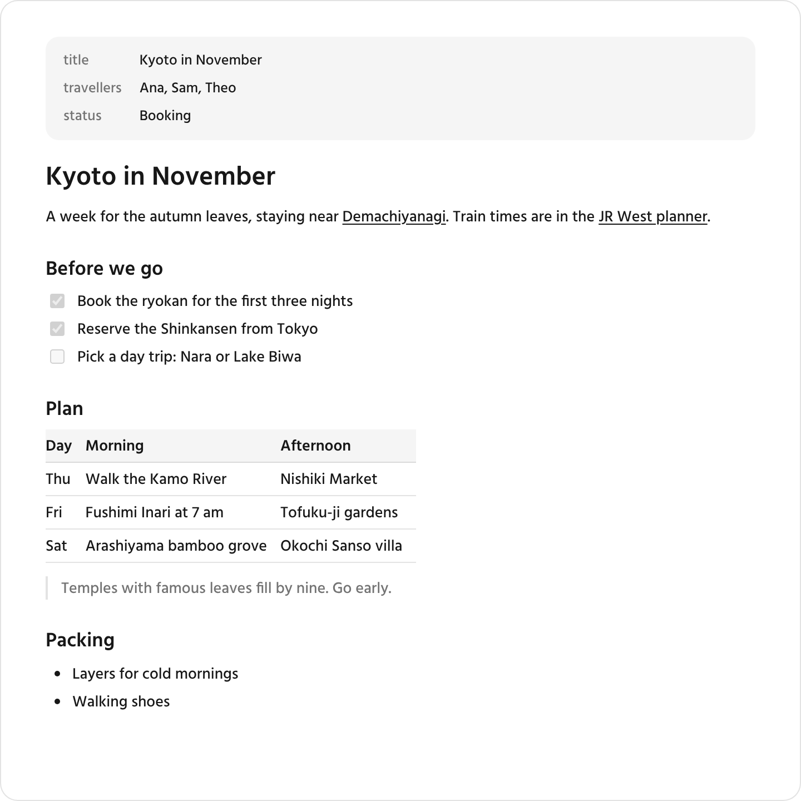
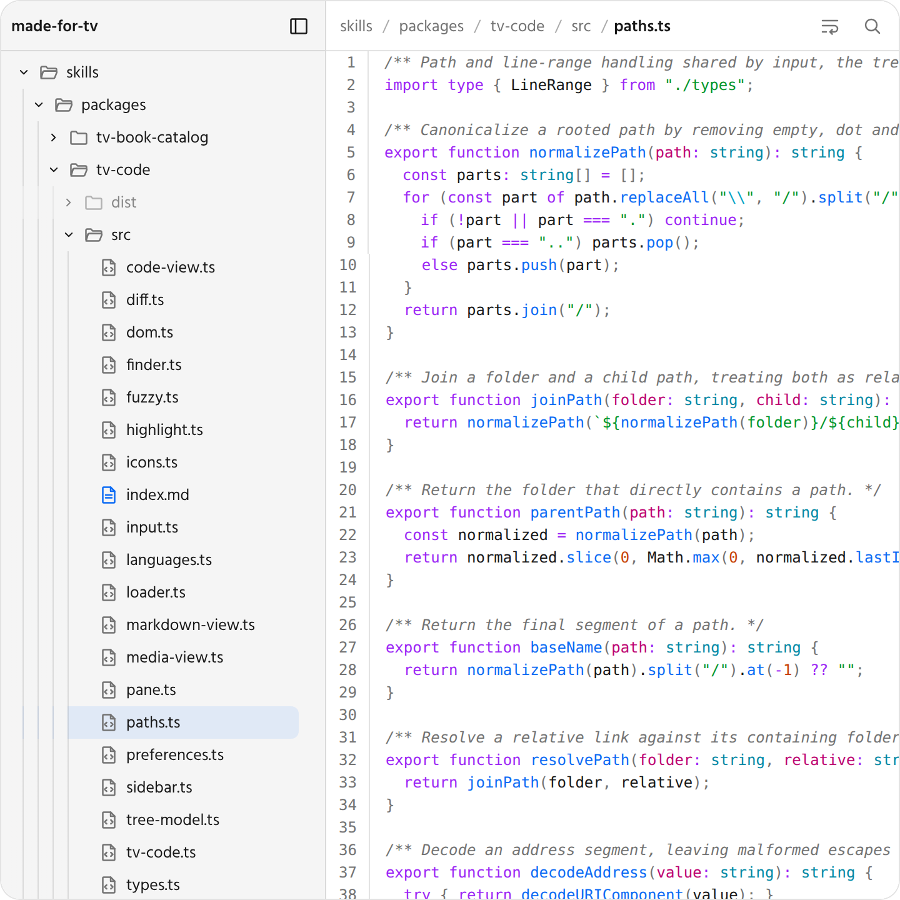

# made-for-tv

Skills and themes made for [Television](https://github.com/telepath-computer/television).

The skills help an agent build beautiful artifacts: the HTML pages an agent makes to show you something. Each skill provides custom HTML elements, such as a Markdown document view or a code viewer, and a `SKILL.md` that tells the agent how to use them. The agent copies the JavaScript and CSS files of the skill next to the `index.html` of the artifact. The elements work in any web page, and inside Television they take on its styles and the active theme.

The themes change how Television itself looks.

## Install the skills

```sh
npx skills add rupertsworld/made-for-tv
```

The [skills CLI](https://github.com/vercel-labs/skills) lists the skills in this repository and asks which ones to install and for which agents. Add `--skill tv-code` to install one skill, or `-g` to install for every project instead of the current one.

To install without the CLI, copy the built files of a skill, such as [`skills/packages/tv-code/dist/`](skills/packages/tv-code/dist/), into a folder named after the skill in the skills folder of your agent, such as `~/.claude/skills/tv-code/` for Claude Code.

To use the elements with Television styles, also install Television, which provides the `television` skill these skills refer to.

## Skills

### [tv-markdown](skills/packages/tv-markdown/README.md)

Renders a Markdown document, with task lists, tables, linkable headings and wikilinks.

<picture>
  <source media="(prefers-color-scheme: dark)" srcset="skills/docs/screenshots/tv-markdown-dark.png">
  
</picture>

### [tv-code](skills/packages/tv-code/README.md)

Shows a set of files, such as a repository, as a file tree beside highlighted code, rendered Markdown and images.

<picture>
  <source media="(prefers-color-scheme: dark)" srcset="skills/docs/screenshots/tv-code-dark.png">
  
</picture>

### [tv-book-catalog](skills/packages/tv-book-catalog/README.md)

Shows book records as cards with covers, and one book in full on a detail view.

<picture>
  <source media="(prefers-color-scheme: dark)" srcset="skills/docs/screenshots/tv-book-catalog-dark.png">
  
</picture>

## Themes

### [Zen Ink](themes/zen-ink/README.md)

Washi-paper surfaces, sumi-ink text and a single vermilion accent over a soft dusk gradient, in light and dark.

To install a theme, copy its folder from [`themes/`](themes/) into the themes folder of Television, which `tv themes-path` prints, then select it with `tv set-theme`, such as `tv set-theme zen-ink`. [`themes/README.md`](themes/README.md) describes what a theme folder holds.

## Layout

The repository has one folder for each kind of thing it holds:

- [`skills/`](skills/) is an npm project with the skills and the tools that build and test them: a package for each skill in `packages/`, and the specifications, Storybook, tests and scripts beside them. Each skill has its built files in `skills/packages/<skill>/dist/`, committed so the skills install straight from the repository. [`skills/spec/index.md`](skills/spec/index.md) specifies the layout, build, tests and screenshots.
- [`themes/`](themes/) has one folder per Television theme, ready to install. Themes have no build step.

## Develop the skills

The skills need Node 24 and npm 11. Run these in `skills/`:

```sh
npm install
npm run build        # build every skill into packages/<skill>/dist/
npm test             # type checks, unit tests and browser tests
npm run storybook    # view the specifications in Storybook
npm run screenshots  # capture the images in docs/screenshots/
```

## Licence

MIT; see [`LICENSE`](LICENSE). A skill that bundles third-party code, such as a Markdown parser, carries the licences of that code in `THIRD-PARTY-NOTICES.txt` in its `dist/` folder.
