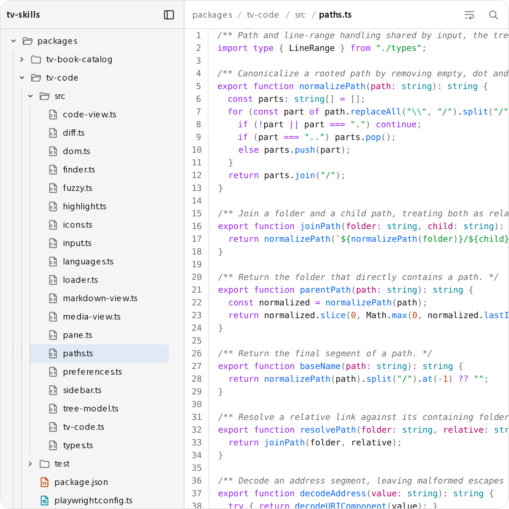

# tv-skills

Agent skills for building beautiful artifacts: the HTML pages an agent makes to show you something. Each skill provides custom HTML elements, such as a Markdown document view or a code viewer, and a `SKILL.md` that tells the agent how to use them. The agent copies the JavaScript and CSS files of the skill next to the `index.html` of the artifact.

Built to work great in [Television](https://github.com/telepath-computer/television). The elements work in any web page, and inside Television they take on its styles and the active theme.

## Install

```sh
npx skills add rupertsworld/tv-skills
```

The [skills CLI](https://github.com/vercel-labs/skills) lists the skills in this repository and asks which ones to install and for which agents. Add `--skill tv-code` to install one skill, or `-g` to install for every project instead of the current one.

To install without the CLI, copy a folder from [`skills/`](skills/) into the skills folder of your agent, such as `~/.claude/skills/` for Claude Code.

To use the elements with Television styles, also install Television, which provides the `television` skill these skills refer to.

## Skills

### [tv-markdown](skills/tv-markdown/SKILL.md)

<picture>
  <source media="(prefers-color-scheme: dark)" srcset="docs/screenshots/tv-markdown-dark.png">
  
</picture>

Renders a Markdown document. It supports GitHub-flavoured Markdown, including tables and task lists, and gives each heading an id that can be linked to. Frontmatter can be shown as a properties panel. `[[wikilinks]]` become links, and the page decides where they lead. Scripts, styles and other HTML outside an allowed list are removed.

### [tv-code](skills/tv-code/SKILL.md)

<picture>
  <source media="(prefers-color-scheme: dark)" srcset="docs/screenshots/tv-code-dark.png">
  
</picture>

Shows a set of files, such as a repository, as a file tree beside the open file. Code is highlighted in about 35 languages, Markdown is rendered and images are shown. Readers can find a file by name with `Ctrl+P` or `Cmd+P`, select lines and wrap long lines. The page supplies the files in the HTML, from a script, or on demand from a service, and the view updates in place when they change. It does not edit files.

### [tv-book-catalog](skills/tv-book-catalog/SKILL.md)

<picture>
  <source media="(prefers-color-scheme: dark)" srcset="docs/screenshots/tv-book-catalog-dark.png">
  
</picture>

Shows book records as a list of cards with cover, title, authors, a short description, genre and rating, and one record in full on a detail view. A book without a usable cover image gets a cover drawn from its title. The page owns navigation between the list and the detail view.

## Develop

The repository needs Node 24 and npm 11.

```sh
npm install
npm run build        # build every skill into skills/
npm test             # type checks, unit tests and browser tests
npm run storybook    # view the specifications in Storybook
npm run screenshots  # capture the images in docs/screenshots/
```

Each skill has a specification in `spec/<skill>/`, source and tests in `packages/<skill>/`, and its built files in `skills/<skill>/`. The built files are committed, so the skills install straight from the repository. [`spec/index.md`](spec/index.md) specifies the layout, build, tests and screenshots.

## Licence

MIT; see [`LICENSE`](LICENSE). A skill that bundles third-party code, such as a Markdown parser, carries the licences of that code in `THIRD-PARTY-NOTICES.txt` in its folder.
